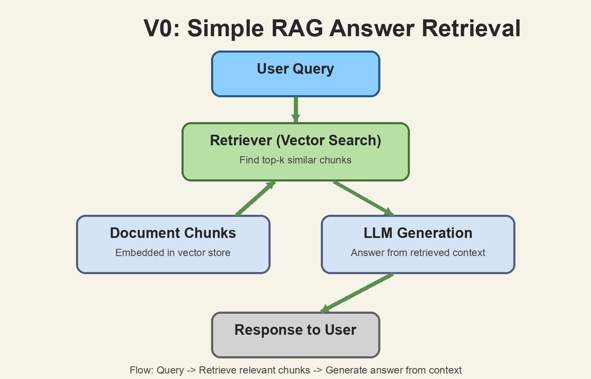
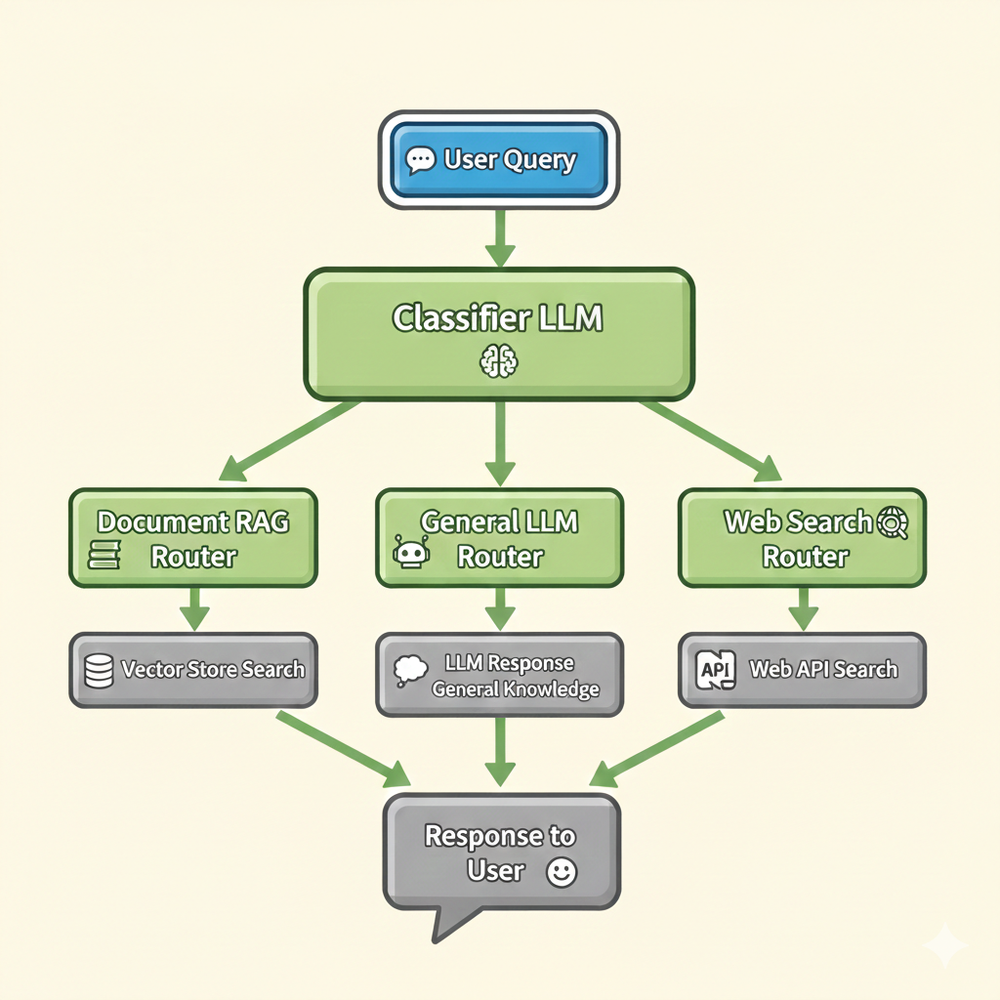

# DocuChat Backend

A practical RAG backend built with FastAPI + LangChain.

This project started as a **simple V0 RAG pipeline** and evolved into **V1 multi-route intelligence** (Document RAG / Web Search / General LLM), with session-based document upload and chat memory.

## Why This Project

Most chatbot backends break when user intent changes mid-conversation.

So the system was built in iterations:
- **V0**: basic retrieval + answer generation from uploaded docs
- **V1**: classifier-based routing to the best pipeline for each query
- **V2 (WIP)**: agentic loop (ReAct + evaluate + iterate)

## Architecture Evolution

### V0: Simple RAG Answer Retrieval



In V0, flow is straightforward:
1. User asks question
2. Retriever fetches relevant chunks from vector store
3. LLM answers from retrieved context

### V1: Classifier-Based Multi-Pipeline Routing



V1 adds a query router that picks one of three paths:
- **Document RAG Router**: answer from uploaded document vectors
- **General LLM Router**: answer using general model knowledge
- **Web Search Router**: answer using live search results

## Core Features

- FastAPI backend with async endpoints
- File upload (`.pdf`, `.txt`) with per-user guest session
- JWT-based temporary session handling
- Document chunking + embeddings + Pinecone vector storage
- Redis chat memory and processing status tracking
- Query routing across 3 pipelines (V1)
- Session cleanup (Redis + local files + Pinecone vectors)

## Tech Stack

- **API**: FastAPI, Uvicorn
- **LLM / Orchestration**: LangChain, LangGraph 
- **Models**: Groq, Google GenAI, OpenRouter/NVIDIA 
- **Vector DB**: Pinecone
- **State/Cache**: Redis
- **Search**: Tavily

## Project Structure

```text
.
├── main.py
├── src/
│   ├── chat.py
│   ├── model.py
│   ├── modelCall.py
│   ├── classifer/
│   │   └── classifier_tool.py
│   ├── tool/
│   │   ├── document_rag.py
│   │   ├── general_llm.py
│   │   └── web_search.py
│   ├── session/
│   │   ├── jwt_verify.py
│   │   └── session_management.py
│   ├── store/
│   │   ├── redis_config.py
│   │   └── classifier_context.py
│   └── reActAgent/   # V2 (WIP)
└── docs/images/
    ├── v0-simple-rag.png
    └── v1-classifier-routing.png
```

## Local Setup

### 1. Clone and install

```bash
git clone <your-repo-url>
cd LangchainProject
python -m venv venv
source venv/bin/activate
pip install -r requirements.txt
```

### 2. Configure environment

Create a `.env` file in project root.

```env
# Session
JWT_SECRET=your_secret_key

# Providers (set what you use)
GROQ_API_KEY=
GOOGLE_API_KEY=
OPENAI_API_KEY=
OPENROUTER_API_KEY=
TAVILY_API_KEY=
PINECONE_API_KEY=

# Optional
REDIS_URL=redis://localhost:6379
```

### 3. Start dependencies

- Run Redis locally on `localhost:6379`
- Ensure Pinecone index is available (default index name in code: `langchain`)

### 4. Run server

```bash
uvicorn main:app --reload
```

Open:
- `http://127.0.0.1:8000/docs`
- `http://127.0.0.1:8000/health`

## API Endpoints

- `POST /upload` - upload document and receive JWT token
- `POST /chat` - ask question (requires `Authorization: Bearer <token>`)
- `GET /status` - document processing status
- `POST /logout` - cleanup user session
- `GET /health` - health check

## Current Status

- **V1**: Integrated and working in API flow
- **V2 Agentic (ReAct)**: Present in `src/reActAgent`, under active iteration

## Future Work

- **V2 (WIP)**: agentic loop (ReAct + evaluate + iterate)

## Notes

- Uploaded documents are stored under `items/<guest_id>/`
- Session token expiry is short by design (guest workflow)
- If token expires, cleanup flow removes chat, metadata, files, and vectors

## License

This project is available for personal and educational use.
